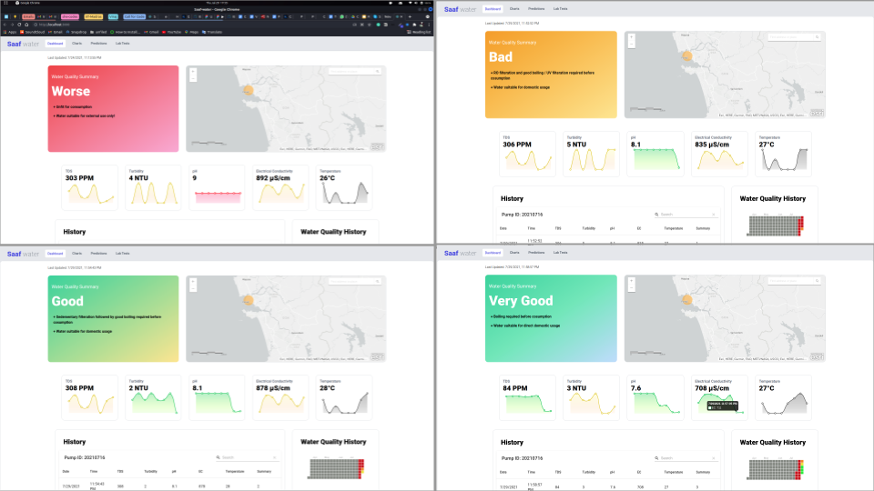

# Saaf Water

## Overview

9 members of Pankaj Rai’s family died in the past 20 years due to arsenic contamination of groundwater, which was only detected in 2017 <u>([Source](https://www.theguardian.com/global-development/2021/jun/24/water-of-death-how-arsenic-is-poisoning-rural-communities-in-india))</u>. Contamination of groundwater is not just a problem in the state of Bihar, India, rather it is a universal problem. Often people in the community do not have access to water quality information, which exposes them to many health complications. Fortunately, the enormity of this issue has been accepted globally, innumerable measures are being worked upon to tackle this issue, however, most of the solutions only provide information to the authorities and do not convey the purification methods for portable use to the actual user of the groundwater source.
 
We have designed a solution that addresses the need of making water quality information accessible. We believe that this platform once installed will frequently monitor the groundwater and communicate purification methods along with the current water quality summary which will help people consume the groundwater safely. 

We call it Saaf water
Saaf water is an open-source AI - IoT platform built over IBM Cloud and Watson services, that makes groundwater information Easy and Accessible to everyone

[Project website](https://saaf-water.eu-gb.mybluemix.net/)

## Key Features

Saaf water is designed to cater to the needs of diverse Demographics. Key Features of Saaf water include:   
1. Frequent Monitoring of water parameters and communication of both purification methods & water quality summary to the community
2. Prediction of seasonal-groundwater quality anomalies (Under Development - Ongoing Data Collection)
3. 24/7 SMS based communication for users having no-internet access and onsite visual indicator for non-technology users 
4. Onsite Biological contamination detection using rapid test to reduce Lab tests for approximate analyses (Under Development - using IBM Watson Visual recognition Service)

### Hardware

Water monitoring and data collection for the Saaf water platform is achieved by a cellular-enabled hardware setup that:

- Auto-calibrates over time
- Collects Water parameter data and sends it to IBM Watson IoT Platform via MQTT 
- Visually indicates the water quality summary for onsite communication about the water quality

All this while the hardware unit being universal to various groundwater extraction interfaces, from community hand pumps and motor pumps to open borewells!

### Software

Our end-users will majorly interact through the Saaf water Dashboard and hence the dashboard is built to deliver important information promptly. Providing essential information at the user’s fingertips while maintaining consistent UX for ease of use was our priority. Features like:

- Colour represented thresholds for charts and water quality summary, intuitively delivers the information that matters to the user.
- Interactive Map allows users to understand neighborhood water quality.
- Flexible option of both table and heatmap calendar to understand information thoroughly or at abstraction respectively.

The Saaf water Dashboard also allows users to view seasonal predictions and the last lab test report which is entered either by the community leader or the authorities on prior notification (Under Development).
 
The entire Saaf water Dashboard is driven through WebSocket protocols by a Node-Red backend, powered by IBM Cloud which handles all the communication between Cloudant NoSQL DataBase, IBM Watson IoT Platform, Twilio for SMS communication, and other IBM Watson services.   

## Vision

We stay in a world where we employ technology at almost every step, from improving personal health to making transactions online. And hence we envision using technology for enabling safe groundwater consumption around the globe. Imagine if Saaf water was implemented at Pankaj Rai’s village, we wouldn't have lost numerous lives out there. Accessibility to safe drinking water is not just impacting  human health but also hurting socio-economic development in the community, thus leading to poor sustainable development and we all know the consequences, Climate Change! 
